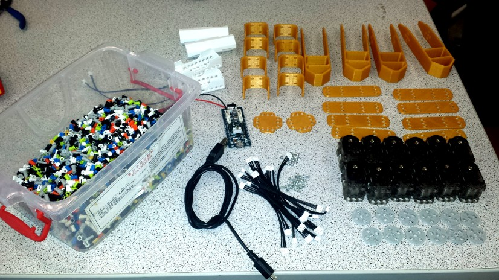
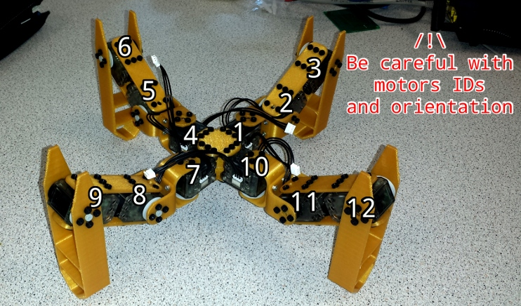
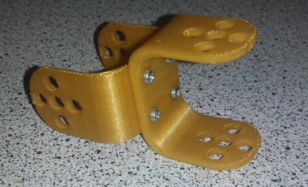
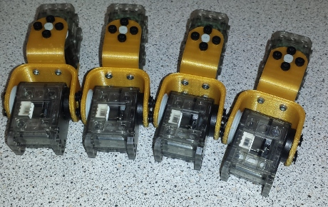
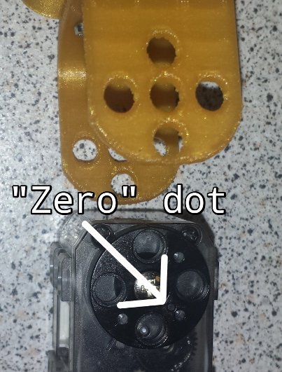
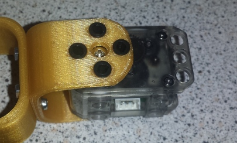
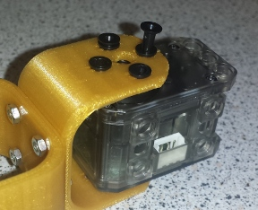
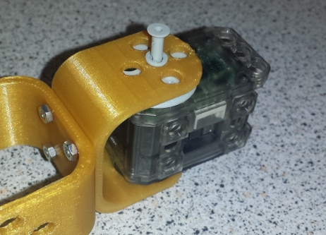
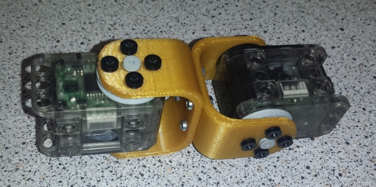

# Assembling Spidey bot

Let's go on!
Now you have all your [parts](parts.md) ready, and your servos [numbered from
1 to 12](ids.md), you can follow this tutorial to assemble your bot.

## Warning

**Be careful: read all the assemble tutorial before begining, if you want to
avoid changing the software, you have to respect the motors direction and IDs**

Before begining, pay attention to the motors IDs and orientations:

## 1) Bind the Us

First, we're going to bind the Us, to do that, just use M2 screws, or glue:

## 2) Put motors on the Us

Now, we're going to put the motors on the Us, just like this:

To do this, you'll need to use Ollo rivets, first, place your motor arm correctly,
if the dot on the arm is like this:

Then the motor is correctly on its "zero position". Put it in the U and put rivets
in it:

Now, "lock" these rivets putting smallest parts in it, like this:

On the other side, insert first a pulley and then put a longest rivet in it:

You can now lock it and put smallest rivets. Repeat this operation to put the
second motor:

