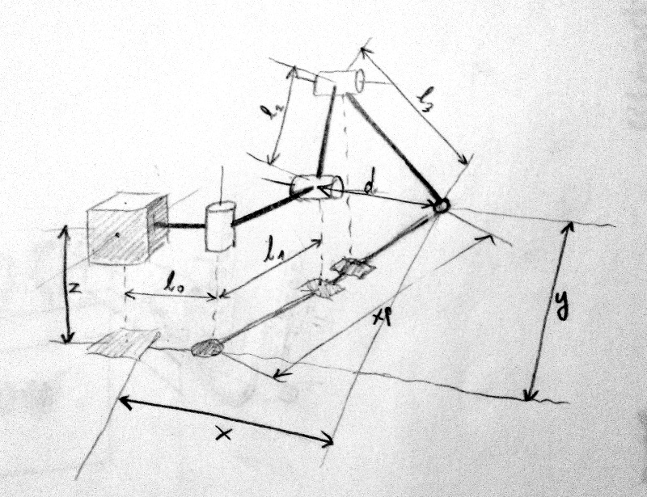

# Kinematic

[« back to the hacking documentation](hacking.md)

Spidey use a geometric model of its legs to work. The code can be
found in `kinematic.h` and `kinematic.cpp`, it was commented for more
understandability.

Here is a draw explaining what the different values represents:

