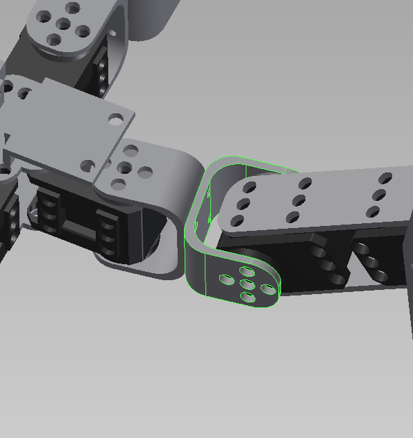
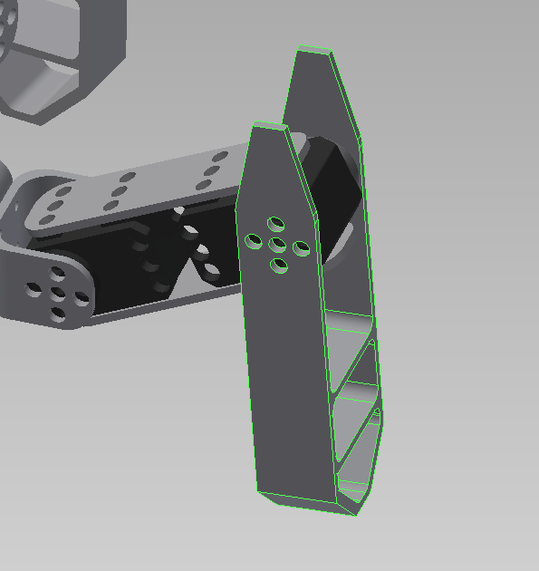
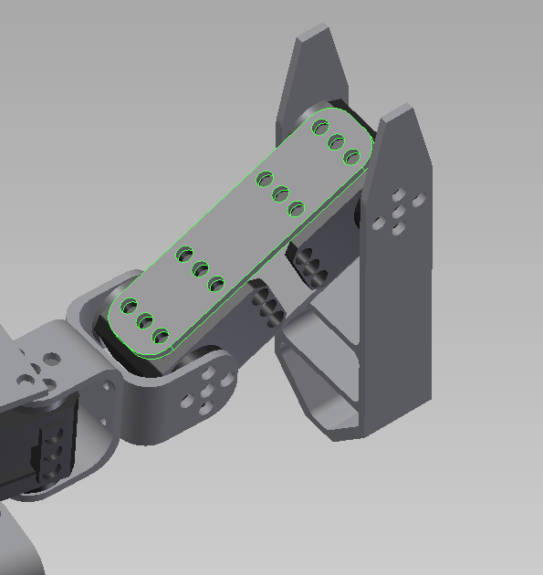
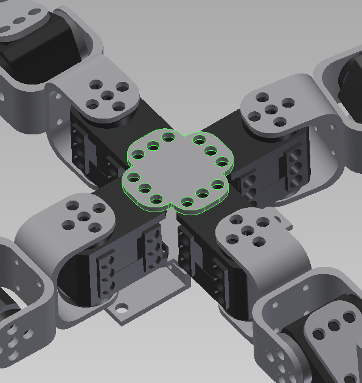
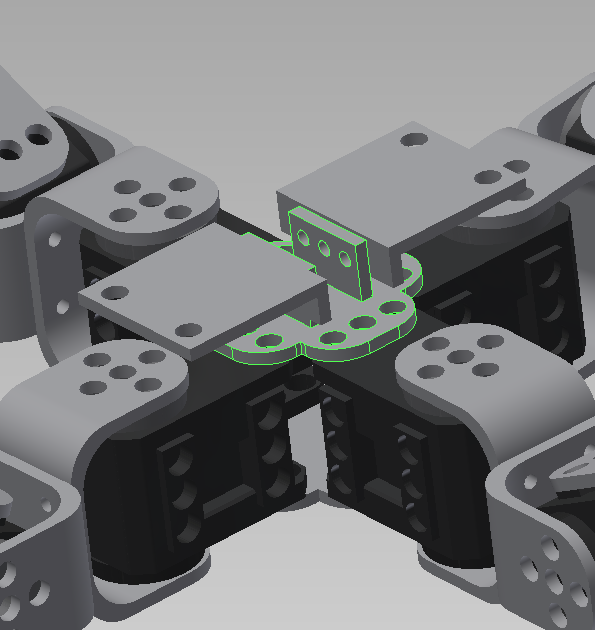
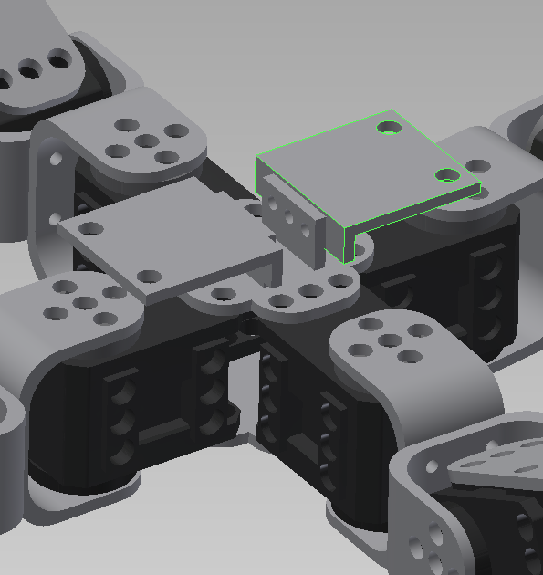
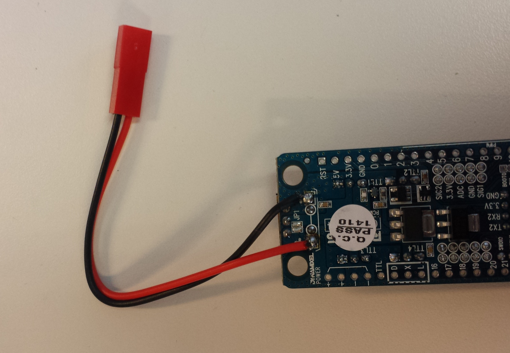

# Parts list

[« back to the documentation](index.md)

To build your own Spidey, you'll need the following parts

## 3D parts

You need all the 3D printed parts that are in the `3d` directory, you'll need to print:

### U (x8)

 

### Leg (x4)

 

### Side (x8)

 

### Body (x1)

You can print this 2 times, or 1 times + 1 body with fixations (see below)

 

### Body with fixations (x1)

 

### Body to OpenCM (x2)

If you print the body with fixations, you can also print that to
bind your OpenCM to the body:

 

## Motors

### 12 x XL-320

http://www.robotis-shop-en.com/?act=shop_en.goods_view&GS=1611

## Bindings

### 3 x Ollo rivet boxes

www.robotis-shop-en.com/?act=shop_en.goods_view&GS=1605

### Screws & nuts

To bind the "U" parts together, you may need M2 screws & nuts:

http://fr.farnell.com/jsp/search/productdetail.jsp?SKU=1420386
http://fr.farnell.com/jsp/search/productdetail.jsp?SKU=1419445

### Ollo tool

You may need an ollo tool to work with ollo rivet

http://www.robotis-shop-en.com/?act=shop_en.goods_view&GS=1602

### Pulleys

You'll need 12 pulleys, you can buy 3x5=15:

http://www.robotis-shop-en.com/?act=shop_en.goods_view&GS=1590

## Electronic

### Main board: OpenCM9.04-C

http://www.robotis-shop-en.com/?act=shop_en.goods_view&GS=2394

## Battery

We recommend using a 2S LiPo, like this:

http://www.hobbyking.com/hobbyking/store/__11902__Turnigy_nano_tech_1300mah_2S_25_50C_Lipo_Pack.html

Note that you'll have to solder a compatible  connector on your OpenCM. For instance, this is a soldered
JST-BEC:

### Optionally, OpenCM++

This is not available on the market, you can build your own using the schematics available in this repository (`opencmpp` directory)

See the [OpenCM++ documentation](opencmpp.md).

### Optionally, WiFi/Xbee module

You can for instance use WiFly:

https://www.sparkfun.com/products/10822

Or XBee radio modules:

http://fr.farnell.com/jsp/displayProduct.jsp?sku=1337912&gross_price=true&CMP=KNC-GFR-FFR-GEN-LISTINGS-OTH-DIGI_INTERNATIONAL&mckv=jKYsenhj|pcrid|33185370662|plid|
